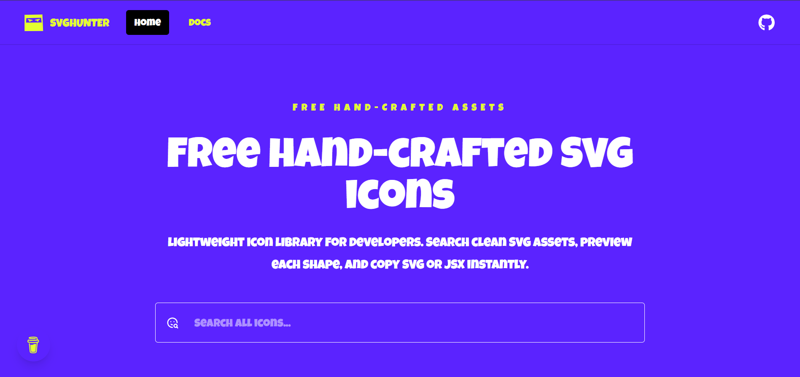

# SVG Hunter

**SVG Hunter** is a free, hand‑crafted icon library for developers. Search through a curated collection of clean SVG assets, preview each shape, and copy the raw SVG or JSX code with a single click. Built for speed, accessibility, and developer joy.

🔗 **Live Demo**: [https://svg-hunter.vercel.app/](https://svg-hunter.vercel.app/)


---

## 📸 Screenshot




---

## ✨ Features

- 🎨 **100% free** – all icons hand‑crafted and royalty‑free  
- 🔍 **Instant fuzzy search** – powered by Fuse.js  
- 👁️ **Live preview** – see every icon before you copy  
- 📋 **Copy SVG or JSX** – one click copies code to your clipboard  
- ⚡ **Blazing fast** – built with Vite + React  
- 🌍 **Internationalization (i18n)** – multi‑language ready  
- ♿ **Accessible** – uses Headless UI for fully accessible components  
- 💅 **Beautiful UI** – styled with Tailwind CSS  
- 🎯 **Toast notifications** – powered by react-hot-toast

---

## 🛠️ Tech Stack

| Category | Tools |
|----------|-------|
| **Frontend** | React 19.2, React Router |
| **Build Tool** | Vite |
| **Styling** | Tailwind CSS |
| **UI Components** | Headless UI |
| **Search** | Fuse.js |
| **Icon Optimization** | SVGO |
| **Fonts** | Fontscource |
| **Notifications** | react-hot-toast |
| **Custom Hooks** | @uidotdev/usehooks |
| **Internationalization** | i18next / react-i18next |
| **Code Quality** | Prettier, ESLint |
| **Icons** | bootstrap |
| **Deployment** | Vercel |

---

## 📦 Installation

Clone the repository and install dependencies:

```bash
git clone https://github.com/Saidbourhabi/svghunter.git
cd svghunter
npm install